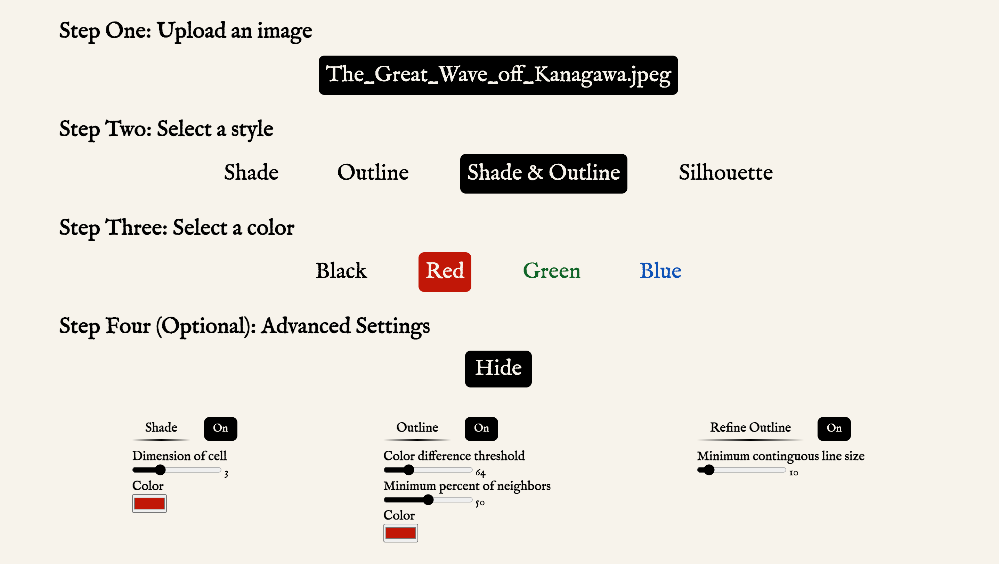
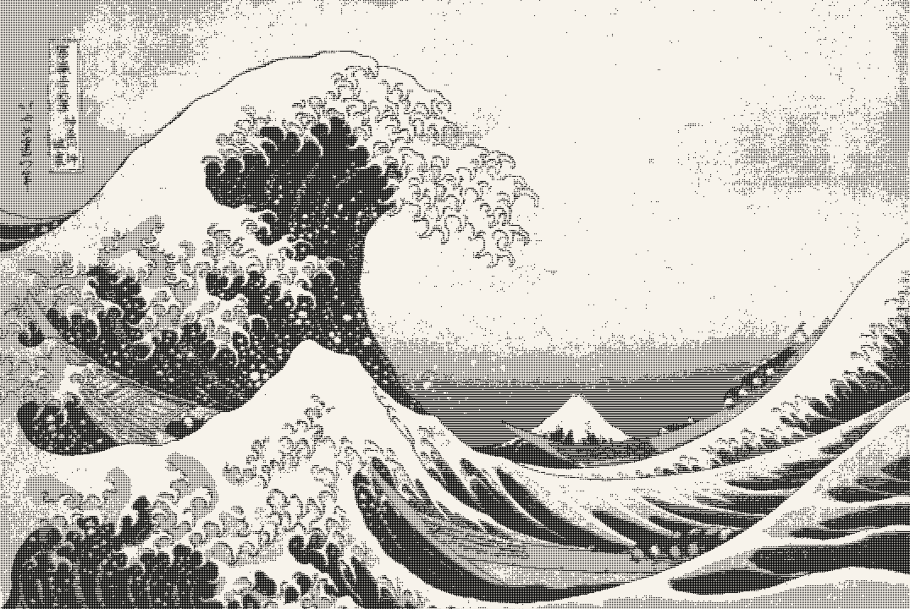
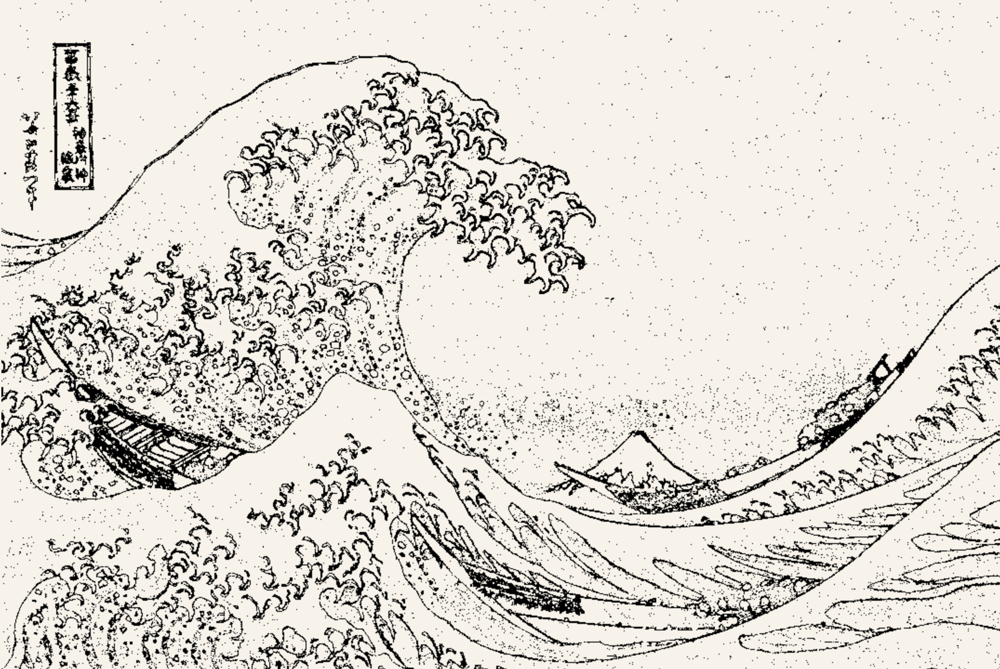
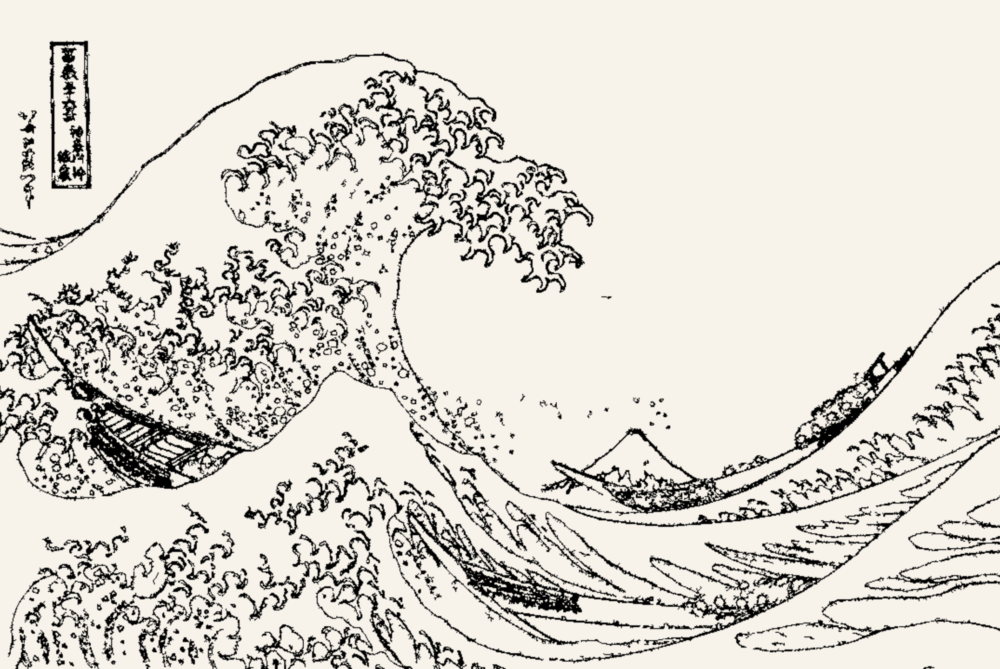
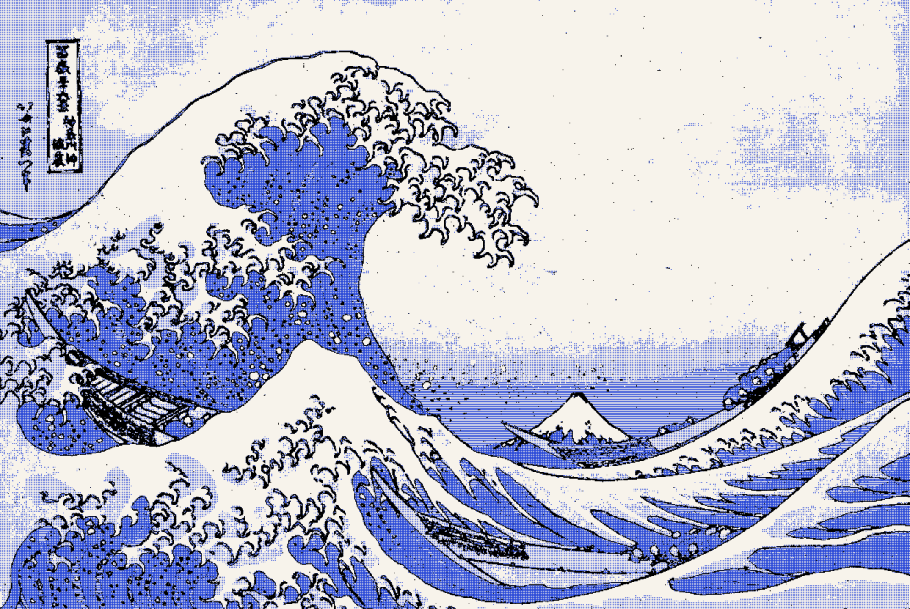
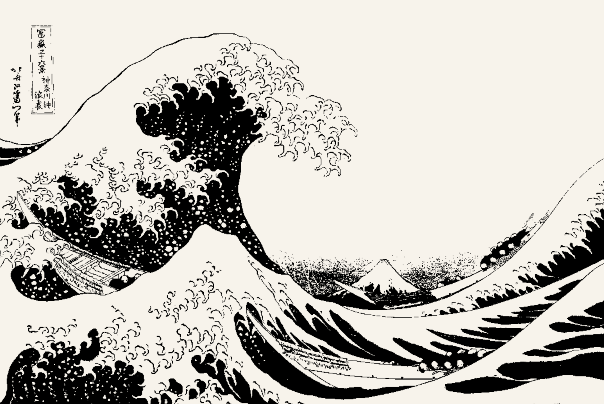

# Etchify

## Description

Etchify is a single page website that creates etchings from user uploaded photos. This is achieved through line recongition and shading that matches the percieved luminosity of the original image. Users are able to customize the produced etching through a variety of settings. The user experience is streamlined so that users need only make essential choices, and can explore more advanced settings if they wish.

## Live

Create an etching [here](https://etchify.io)!

## Table of Contents

- [Description](#description)
- [Live link](#live)
- [Languages & Technologies](#languages--technologies)
- [On Features & Functions](#on-features--functions)
- [On Pixel Logic & Code](#on-pixel-logic--code)
- [Future considerations](#future-considerations)

## Languages & Technologies

- Node.js
- Vanilla DOM manipulation
- HTML5
- SCSS
- Canvas API
- Webpack for bundling javascript
- Npm for managing dependencies

## On Features & Functions

For the etching, users are directed to upload an image, select a color, and select one of four styles: **Shade**, **Outline**, **Shade & Outline**, and **Silhouette**. Of additional note, among the advanced settings, users can decide the shading and outline colors separately and can opt for **Refine Outline**.

<p align="center">
  
</p>

As an example image to be processed, we will use *The Great Wave off Kanagawa* by Hokusai.[^1] The woodblock print's contrast in brightness and solid colors are well-suited for the software, though great results can be achieved with a wide variety of images.

<p align="center">
  
</p>

- **Shade** will analyze the original image as a grid of *n* by *n* cells, and will match the percieved luminance of each cell with an appropriate amount of shading. The percieved lumninance of each pixel in the cell is calculated from its *RGB* values using an industry standard formula:<p align="center">Luminance = .299(R) + .587(G) + .114(B)[^2]</p>The size of *n* is referred to as the **Dimension of the Cell** and can be adjusted as an advanced setting. Increasing the **Dimension of the Cell** has a twofold impact: it simultaneously increases the pixellation of the resulting image, while also increasing the number of tones.

<p align="center">
  
</p>

- **Outline** employs line recongition to trace the original image. A candidate pixel is designated as a line if it differs enough from its neighbors. This calculation is performed with a five by five kernel centered on the candidate pixel. The neighboring pixels each "vote" on if the candidate pixel is a line. With each neighboring pixel, their vote depends on if their color difference exceeds the **Color Difference Threshold**, an advanced setting, and is weighted according to the inverse square of their distance from the candidate pixel. If the overall vote exceeds the **Minimum Percent of Neighbors**, an additional advanced setting, the candidate pixel is considered part of the outline.

<p align="center">
  
</p>

- **Refine Outline** is an advanced option that allows the user to reduce the "noise" produced by the **Outline** algorithm. It achieves this by removing any line pixels that are not part of a sufficiently large contiguous line complex. This threshold can be adjusted as the **Minimum Contiguous Line Size**. Currently this features employs a 2d array of line pixels, which while functional, has poor time and space complexity, and is in need of refactoring with a linked list.

<p align="center">
  
</p>

- **Shade & Outline** merely employs both the **Shading** and the **Outline** algorithms at once, with the outline resting atop the shading.

<p align="center">
  
</p>

- **Silhouette** is actually a particular application of the **Shading** algorithm, produced by setting the **Dimension of the Cell** to one. The result is that each pixel is considered its own cell, which means that there is essentially no pixellation, but each pixel can only be one of two tones: the background color or the shading color.

<p align="center">
  
</p>

## On Pixel Logic & Code

```javascript
processImage(){
    this.pixels = {}

    for (let row = 0; row < this.height; row++) {
      for (let column = 0; column < this.width; column++) {
        let currentIndex = this.pixelIndex(row, column)
        let currentRGB = this.retrievePixelRGB(currentIndex)
        let currentDarkness = this.calculateDarkness(currentRGB)
  
        this.pixels[currentIndex] = new Pixel(currentRGB, currentDarkness)
  
        let currentPixel = this.pixels[currentIndex]
        
        \\ The below conditional tests if the user
        \\ selected to draw the outline
        if (this.line) {
          let precedingNeighbors = this.precedingNeighbors(row, column)
  
          precedingNeighbors.forEach( (neighborValues) => {
            let neighborIndex = neighborValues[0]
            let weight = neighborValues[1];
            let neighbor = this.pixels[neighborIndex];
            let neighborRGB = neighbor.colors;
            let colorDifference = this.calculateColorDifference(currentRGB, neighborRGB);
            Pixel.addColorDifference(currentPixel, neighbor, colorDifference, weight)
          })
        }
      }
    }
  }
```
The above function is the initial image processing. It proceeds by rows and columns, instead of the raw pixel index, in order to make its operation more inutuitive. It creates a *Pixel* instance for every pixel in the source image, which is saved in an object called *Pixels*. Each *Pixel* has its colors and luminance saved, and if outline is selected, the color differences and inverse-squared-distances (referred to as weight) of its neighbors are saved as well. As a minor optimization, since the neighbor relationship is mutual, the static *Pixel* method```javascript addColorDifference()``` adds the combination of color differences and weights to both *Pixel* instances.


## Future Considerations


[^1]: The source for this image can be found [here](https://en.wikipedia.org/wiki/File:Tsunami_by_hokusai_19th_century.jpg).
[^2]: This formula is typically used to calculate the *Y* component in *RGB* to *YIQ* conversion. Documentation can be found [here](https://www.eembc.org/techlit/datasheets/yiq_consumer.pdf).
