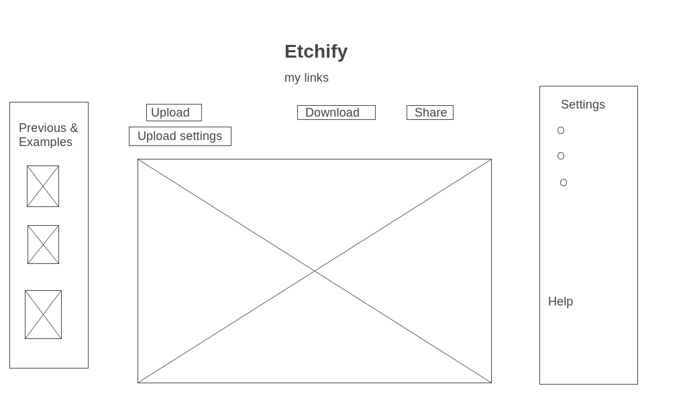

# Project Proposal for Etchify

## Background and Core Functionality

This website is inspired by traditional etchings and lithographs, as well as graphite artwork where shading is achieved with discrete linework. The website will allow a user to upload an image, and will then produce and render a copy of that image that emulates the aforementioned art styles. This will first and foremost entail matching the opacity of each part of the original image with shading techniques inspired by etchings: hatching, cross-hatching, contouring, cross-contouring, stippling, etc.

Some of these shading techniques--namely contouring and cross-contouring--require some knowledge of the bounding region. This would ideally be provided by determining the principle linework of the original image. This can thought of as creating a coloring-book version of the original version, which can then be filled in with the appropriate shading. (Creating coloring-books images may be another potential user for this software.) In order to perform the contouring and cross-contouring, the linework would not only need to be identified, but the bounded regions would also need to be parsed.

## Secondary Functionality and Dynamic Features

Beyond uploading the original image, the user of the website would also be able to customize various aspects of the produced image:

- The hatching/shading pattern being used
- The color of the produced artwork
- The sensitivity of the linework, i.e. how dramatic a change in color or opacity in the original is required to register as a line
- The contrast--while the software is principally designed to match opacity, it could also allow the user to shift everything in the image to the extremes of light and dark
- They could toggle the linework to appear and disappear, and adjust its thickness, which will be distinct from sensitivity
- The shading sensitivity--this would essentially be how large a region is sampled in the original for its average opacity and then replicated with hatching in the generated image

Assuming the parsing of bounded regions is successful, the user will have access to further features:

- They could change the color and hatching/shading pattern of each individual region

With all of these features, the exact latency is not clear at this time. In particular, the line sensitivity may need to only be adjustable with the initial upload, as it directly affects the number and shape of the bounded regions. The shading sensitivity would also likely be high latency

Though not a feature the user can control, the website will hopefully initially render the generated image via a short animation that begins by drawing the linework and then filling in each region. Ideally, a relevant sound effect will accompany this. If there is such a sound effect, there will be mute button. If this turns out well, there may be a button to allow the user to replay it

Additionally, the user will be able to select from a group of provided examples, and ideally will have any recent creations of theirs saved temporarily

One last feature that seems worth implementing is finding a way to allow users to directly share images they created on social media. This would ideally include the option to share the aforementioned animation

## Wireframe:

##  Required Technologies

- Canvas API
- Webpack and Babel

## Implementation Timeline:

### Friday Afternoon & Weekend:

- Build the initial functionality that allows for the uploading an image and select shading sensitivity, and parsing it into its constituent pixels
- Build the structure for showing a user a generated image
- Finish unidirectional, cross-hatching, and stippling renders that match opacity with the given shading sensitivity
- Implement color selection

### Monday:

- Generate linework by picking out pixels where there is a sufficiently dramatic shift in color or opacity
- Build in functionality for the user to adjust line sensitivity, thickness, and presence 

### Tuesday:

- Build region recognition and implement improved hatching/shading techniques that are responsive to the shape of the regions
- Begin work on region by region specific features

### Wednesday:

- Work on any unfinished principle features
- Work on styling and in particular on the initial draw animation

### Thursday Morning:

- Polish styling and share on the internet

### Bonus features:

- Work on making the images immediately shareable

